# Greetings 👋 I'm Valentin

## 👨🏻‍💻  About Me

I’ve always enjoyed working with and understanding technology.

Beyond spending time in front of the computer doing various coding work, I have a special passion for working with imaging systems — exploring photo- and videography while diving into the physics of optics and light as well as the technology behind "capturing", digitalizing and processing it.

In my free time, you’ll often find me:
- 🧗 Climbing  
- 🏃 Running  
- 🏊 Swimming  
- 👫 Hanging out with friends  
- 🐕 Taking walks with our dog Dobby (The best dog in the world [photo](Assets/Dobby.jpeg))  
- 🎸 Playing my bass guitar  

---

## 🎓 Education and Work 

  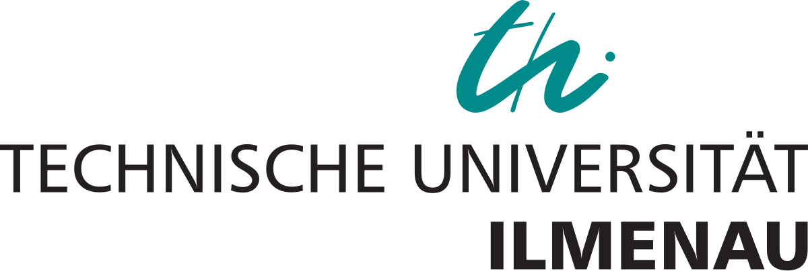

Because of my interest in technology, I decided to study [Media Technology](https://www.tu-ilmenau.de/studium/vor-dem-studium/studienangebot/masterstudiengaenge/medieningenieurwissenschaften-m-sc) (now called Media Engineering Sciences) at the [Technical University of Ilmenau](https://www.tu-ilmenau.de/) and graduated with a Bachelors and Masters degree in.

The Bachelor's degree can be described as a basic engineering course, which includes various mathematical, electrotechnical, physical, signal processing and computer science basics as well as special media technology subjects such as audio and video technology.

The Master's program was bilingual with subjects in German and English. Due to it´s modular structure it gave me the opportunity to choose subjects that particularly interested me.
There, I specialized in image and video processing (and coding), optics and lighting technology as well as machine learning.

During my studies, I worked as a student assistant for the [Faculty of Audiovisual Technology](https://www.tu-ilmenau.de/universitaet/fakultaeten/fakultaet-elektrotechnik-und-informationstechnik/profil/institute-und-fachgebiete/fachgebiet-audiovisuelle-technik) in Ilmenau.

  

#  

 
 

  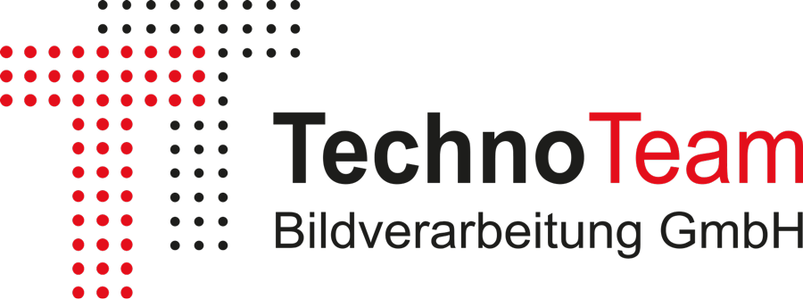

Additionally, I completed my mandatory internship, my bachelor thesis, and worked as a working student at [TechnoTeam Bildverarbeitung GmbH](https://www.technoteam.de/), a company specializing in light measuring devices and image processing in that field.

During my mandatory internship I mainly worked on creating a Python wrapper for the ActiveX server of the measurement software. Besides that I wrote small automation scripts and documentation in various languages/frameworks (Python, C#, LabVIEW, MATLAB, Octave).

As working student, I worked together with customer support and helped with questions to the ActiveX server.  Additionally I helped testing camera optics for their applicability in luminance measurement applications.

Another project I worked on was the [DUGR Calculator](https://www.technoteam.de/main/applications/light_sources__luminaires/general_lighting/dugr_calculator/index_eng.html), which is is a free and open-source test environment written in Python for calculating UGR characteristic values according to CIE 232:2019. 
I was also allowed to present this project at one of europes biggest lighting conferences, the "LICHT2023" in Salzburg.

➡️ [Github Repo](https://github.com/TechnoTeam-Bildverarbeitung-GmbH/DUGR_GUI)

For more detail on my Bachelor Thesis, see [Scientific Work](#scientific-work) below.

 

#  

 
 

  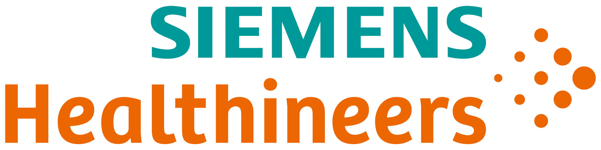

For my master thesis, I worked together with [Siemens Healthineers](https://www.siemens-healthineers.com/de), where I gained insights into the healthcare sector and developed my ambition to use and expand my knowledge in the field of optics, image processing and software development to work on advancing imaging systems in the medical field and improving patient care in the future.

For more info about my master thesis, see [Scientific Work](#scientific-work) below.

 

#  

 
 

  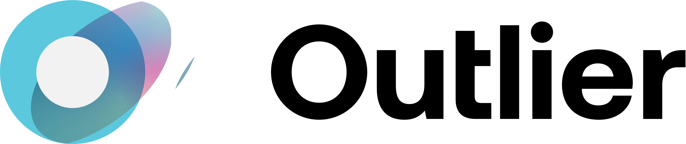

While I am looking for a fulltime position, I am working as Tier 3 Python freelancer for [Outlier.ai](https://outlier.ai/), where I am designing and optimizing prompts to train LLMs for coding related tasks, including code generation, refactoring and debugging as well as reviewing and rating the LLM output.

 

---

### Scientific Work:

 

📜 Master Thesis: [Assessing remote desktop applications for medical imaging in varying network environments](https://bibliographie.tu-ilmenau.de/servlets/DozBibEntryServlet?mode=show&id=ilm_mods_00020464)

Conducted research as well as subjective and objective testing at Siemens Healthineers to improve the perceived quality of remote scanning with medical imaging systems (CT, MR).

This involved developing a C++ program to manipulate a video signal in order to simulate varying frame rates and compression levels, as well as a Python GUI to guide through the subjective testing process and to document the retrieved data.

Additionally, the content to be transmitted was analyzed in regards to temporal and spatial information, as well as color and frequency domain properties, to spot potential points of improvement for compression.

To back this up, objective analysis was done on the test content, using various state of the art compression algorithms and objective (full reference) quality metrics.

#  

📜 Bachelor Thesis: [Untersuchung des Einsatzes von AR/VR-Systemen für die Kalibrierung/Referenzierung einer fokusbasierten Abstandsmessung mit elektronisch fokussierbaren Objektiven](https://bibliographie.tu-ilmenau.de/servlets/DozBibEntryServlet?mode=show&id=ilm_mods_00004164)

Worked on a distance calibration process for focusable lenses of luminance measuring cameras using virtual images. This involved the evaluation of different devices to display virtual images, python based automation of measurements based on criteria for determining the quality of focus adjustment, creation of a mathematical model, as well as error estimation based on Monte Carlo simulations.

#  

📜 Media Project: During the masters degree we worked on an open 8K HDR source dataset for video quality research (AVT-VQDB-UHD-2-HDR)

  - Paper: [AVT-VQDB-UHD-2-HDR: An open 8K HDR source dataset for video quality research](https://ieeexplore.ieee.org/document/10598268)
  - GitHub Repo: [Telecommunication-Telemedia-Assessment - AVT-VQDB-UHD-2-HDR](https://github.com/Telecommunication-Telemedia-Assessment/AVT-VQDB-UHD-2-HDR)

---

## 📚 Online Courses

Besides doing the freelance work at Outlier.ai, and educating myself (see "Currently Exploring and Improving" below) I am also doing online courses in topics which I think might be helpful for my professional career in the future. 
Here are some of the courses I took recently:

#  

  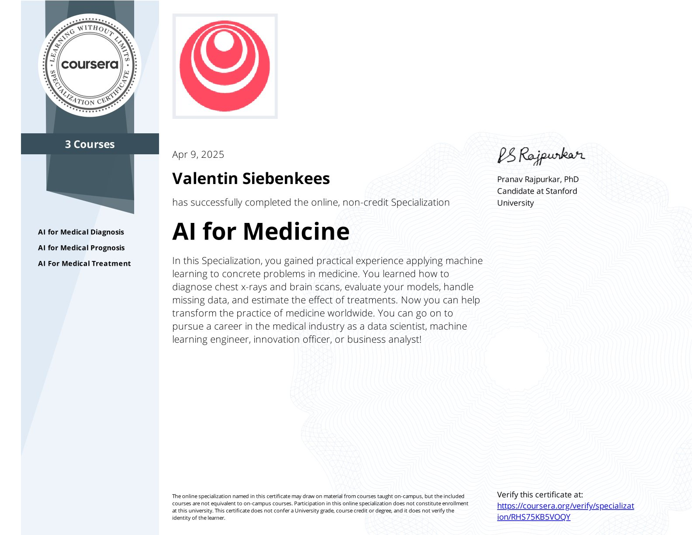 
  <em>AI for Medicine Specialization
     
    Consisting of:
  </em>

<table align="center">
  <tr>
    <td align="center">
       
      <em>AI For Medical Diagnosis: 
        Exploring Data 
        Handling Class Imbalance and Small Sets 
        Building Models for Segmentation & Classification 
        Evaluating Model Performance with Key Metrics
      </em>
    </td>
    <td align="center">
      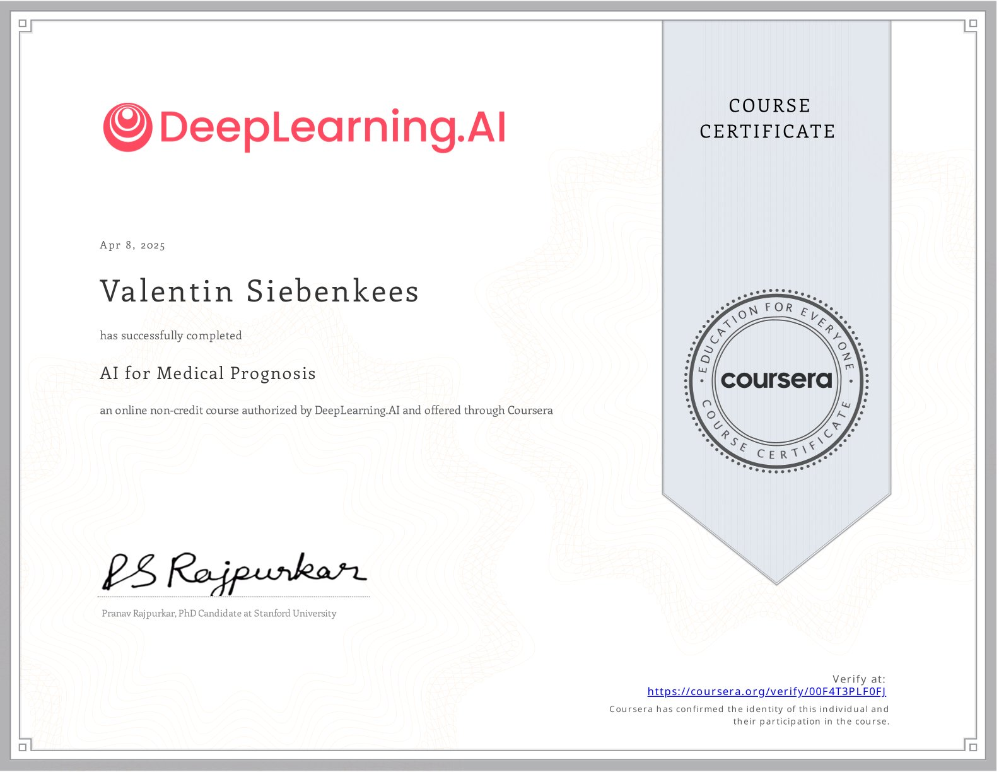 
      <em>AI For Medical Prognosis</em>
    </td>
    <td align="center">
      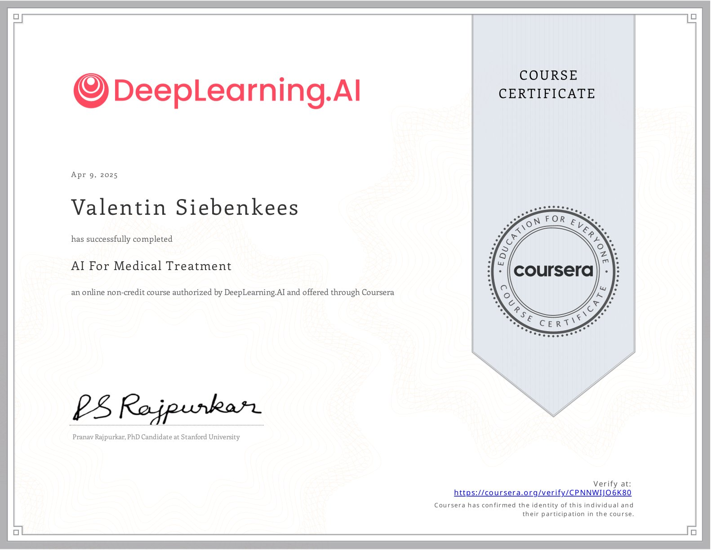 
      <em>AI For Medical Treatment</em>
    </td>
  </tr>
</table>

 
 

#  

  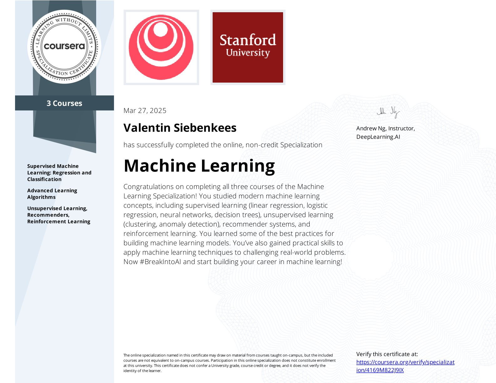

  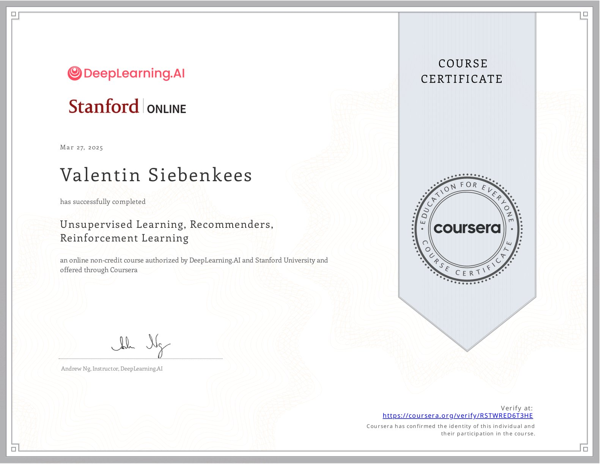
  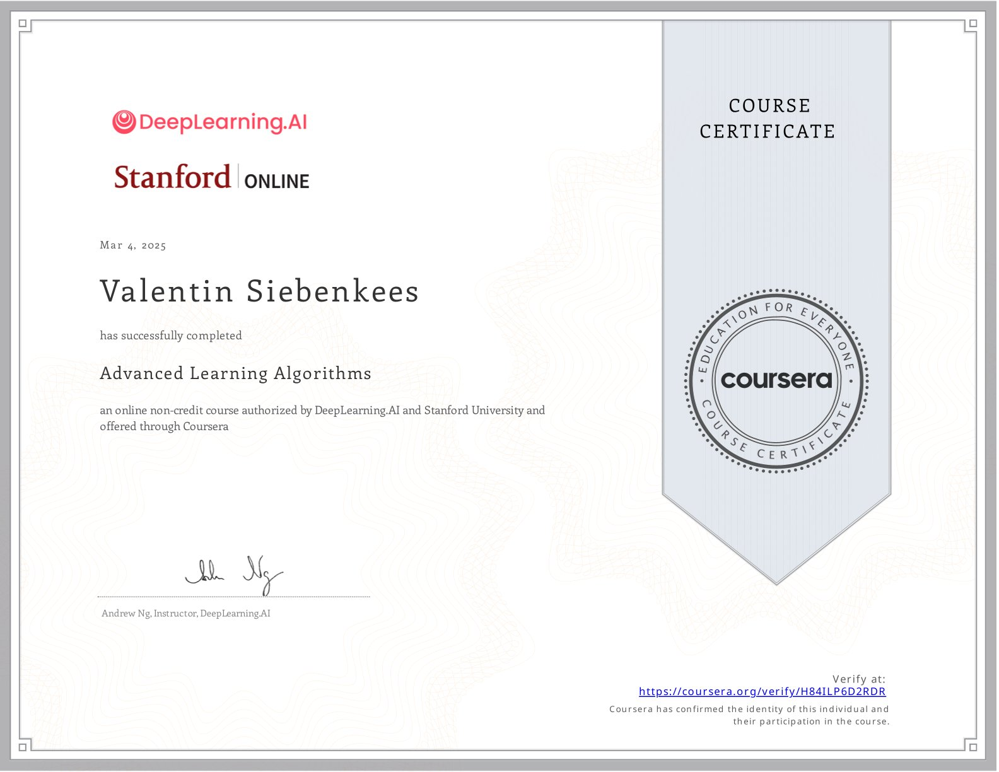
  

 
 

#  

  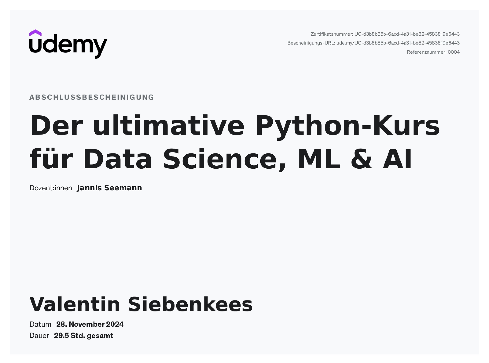
  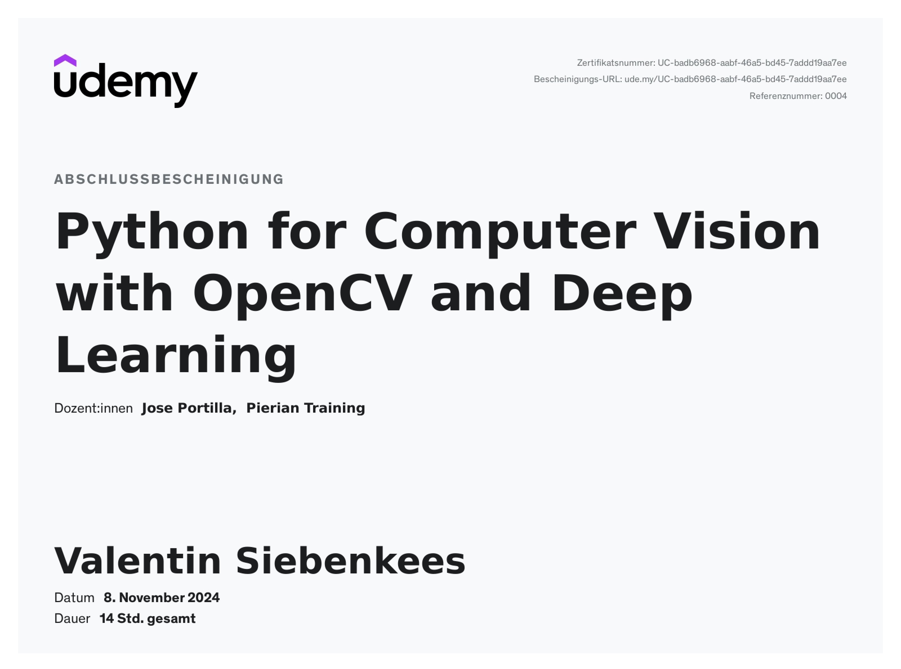
  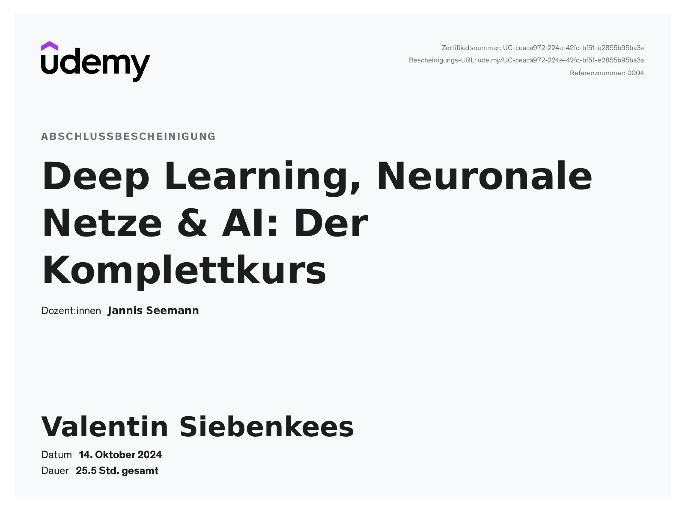

---

## 🌟 What I’m Passionate About

* 💻 Programming – algorithms, architecture, and clean code (Python and C++)
* 🏥 Medical Imaging – capturing, processing, and evaluating medical images
* 🎥 Image & Video Processing – from coding to enhancing visual experiences
* 💡 Light & Optics – understanding and leveraging the science behind optical systems and physics of light
* 🤖 Machine Learning – applying AI to improve processing aswell as classification tasks in various imaging applications
* 👁 Human Perception – exploring how we perceive image and video (quality)

---

## 🚀 Currently Exploring & Improving

* __Python__ – My go-to language for many tasks. I have a strong foundation but want to further improve and keep learning more advanced concepts.
  
* __C++__ – A language I have good experience with, but I am focusing on learning it in a more structured way, covering best practices and deeper language details.
  
* __Machine Learning__ – I took courses during my Master’s degree, but I am revisiting core concepts and deepening my knowledge by completing courses from DeepLearning.AI and Stanford Online.
  
* __Medical Imaging__ – Includes different subtopics, e.g. concepts of medical imaging devices, how to apply machine learning on medical images, but also important medical standards
  
* __Data Structures and Algorithms__ – I wanted to learn DSA including BigO, Searching Algorithms, Sorting Algorithms and Advanced Algorithms
  
* __LeetCode__ – Recently I started doing LeetCode Problems, to structure it I am mostly following the [NeetCode Roadmap](https://neetcode.io/roadmap)
  
* __Optics__ – A topic where I have a good foundation due to subjects in university and my work at TechnoTeam. It is a topic I think is really interesting and therefore I wanted to revisit some concepts, including the physics of light and design of optical systems

* __Signal Processing__ – Some Signal Processing topics I learned in university, which I wanted to revisit (Signal Representation, Sampling & Quantization, Convolution, Transformations) 
  
* __Math__ – I also wanted to revisit some math concepts and go into detail when it comes to math used in machine learning (Linear Algebra, Calculus, Statistics, Linear Models & Optimization)

---

## 🛠  Tech Stack

---

## 📫 Let’s Connect!

I’m always eager to learn, collaborate, and grow! Feel free to reach out:

